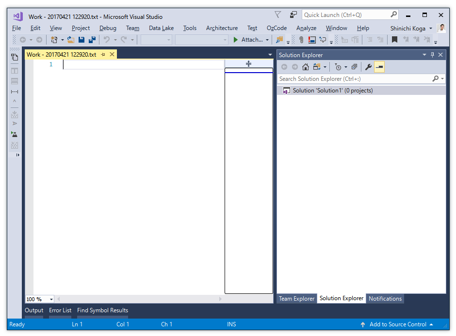
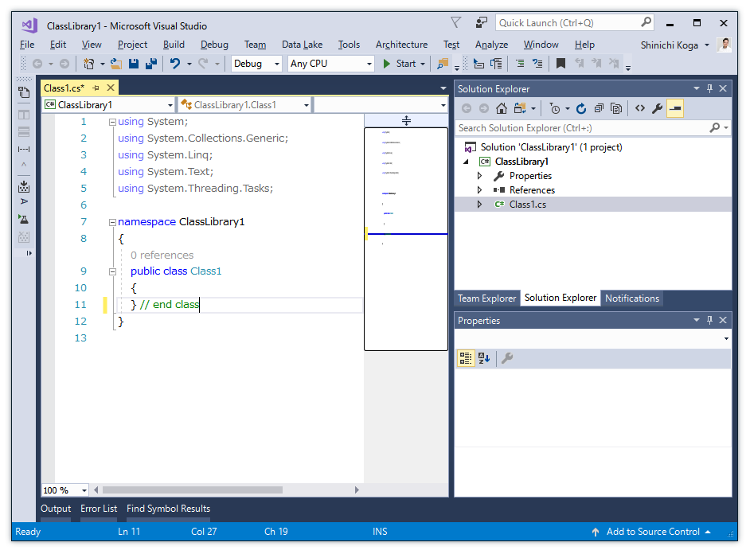
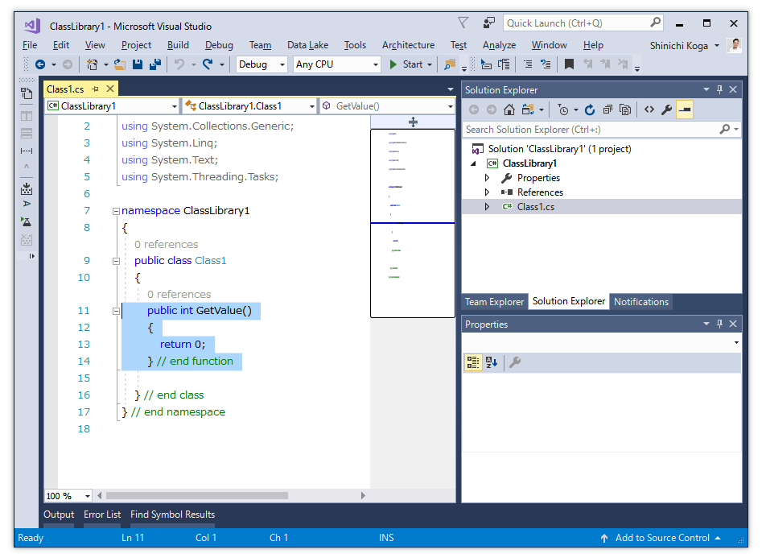
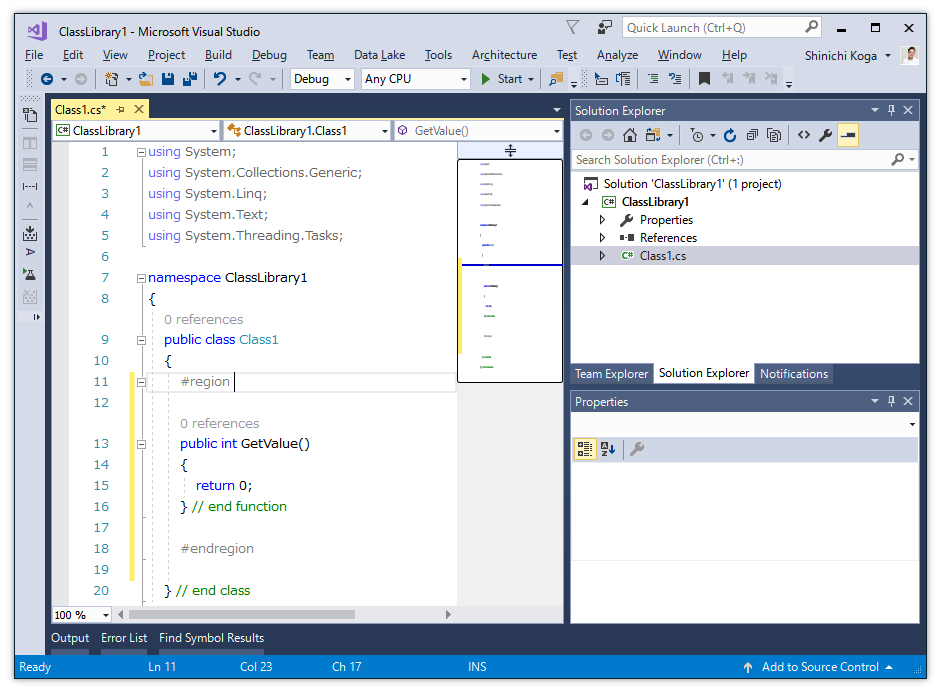
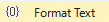
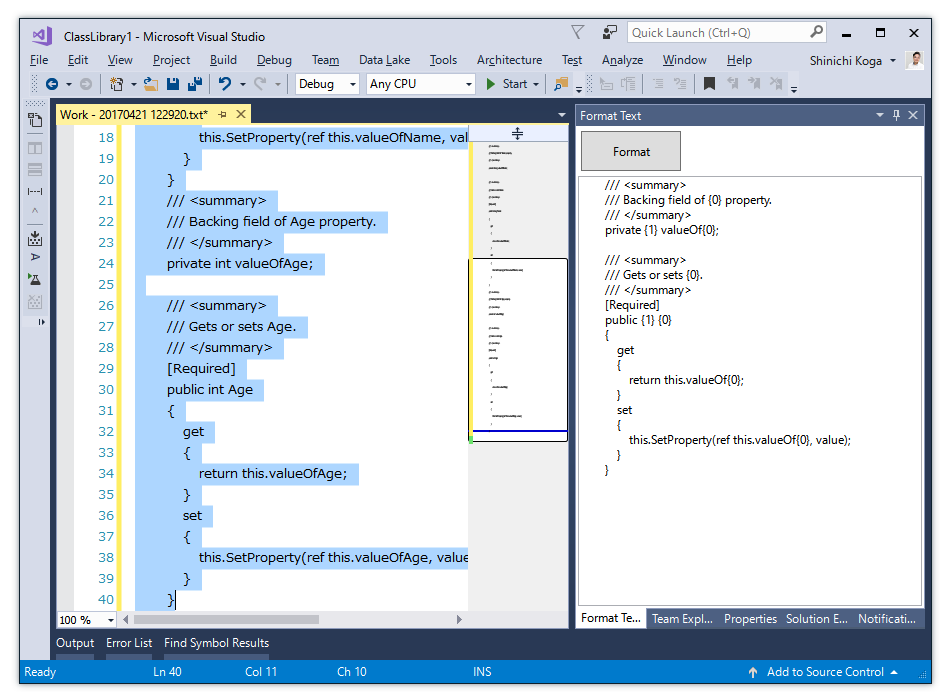

# How to use EditorPlus for Visual Studio

## Installation
- Search and install in **Extensions and Update** of Visual Studio.
- Otherwise download from Marketplace and double click EditorPlus.vsix file.
  - [Download For Visual Studio 2017](https://marketplace.visualstudio.com/items?itemName=SHIN-ICHIKOGA.EditorPlusforVisualStudio2017)
  - [Download For Visual Studio 2015](https://marketplace.visualstudio.com/items?itemName=SHIN-ICHIKOGA.EditorPlus)

## Features
### [ FILE ] Create New Working Text File 
Create a text file on Desktop to use it as working, for example to use it for "Format Text" feature of this addin.
1. Click **FILE** >  menu command.
1. A text file is created on Desktop, and Visual Studio opend it.
 
This working text file is not include in solution or project of Visual Studio. It remain on Desktop after that Visual Studio is closed.

### [ FILE ] Open Folder for the Active File 
Open File Explorer for a active file of text editor, otherwise a active folder of Solution Explorer.

1. Click  **FILE** >  menu command.
1. File Explorer is opened.
1. If necessary, set the shortcut to this command. 
-  For a file, this function is same as **Open Containing Folder** of active text editor.
 - For a folder, this function is same as **Open Folder in File Explorer** Command of [Solution Explorer].

### [ EDIT ] Insert Visual Basic Like Comments into End of Block ( for C&#35; only ) 
Visual Basic code is excellent in visibility. The end of the code block is immediately found in the form of a letter. You can use this feature to insert similar comments early.
1. Open C&#35; code file.
1. Select inner position of code block, that are namespace, class and function.
 
1. Click **EDIT** > **Advanced** >  menu command.
1. A comment is inserted at the end of code block. And text cursor(caret) is jump to the comment.
 
1. If necessary, set the shortcut to this command. 

### [ EDIT ] Enclose Selection in &#35;region ( for C#, Visual Basic, JavaScript, TypeScript ) 
This function is same as Code Snippet for outline. If you use this, you can enter a little earlier.
1. Open C&#35;, Visual Basic, JavaScript or TypeScript code file.
1. Select text lines.

1. Click **EDIT** > **Advanced** >  menu command.
1. &#35;region  and &#35;endregion are inserted. And text cursor(caret) is jump to a position for outline title.
 
1. Inpout outline title here.
1. If necessary, set the shortcut to this command. 

### [ VIEW ] Format Text 
TSV (Tab separated values) are formatted like String.Fromat( "{0} {1}", ... ) method.

Use this function to make a lot of unit test stationery, instead of parameterized unit test. For example when you need to rewrite each little. Or use it as a simple snippet, as shown in the following example. You can create statements from values in an Excel sheet, such as office mail merge.

1. Click **VIEW** > **Other Windows** >  menu command to show tool window.
1. Open a working text file. Use "Create New Working Text File" feature of this addin.
1. Input format text to **Format Text** tool window and input values to the working text file.

The format is similar to string.Format method. {Number} becomes a placeholder, for example {0} {1} {2} ...
Values should be separated by Tab character, like coping from Excel sheet, for example"A\tB\tC..."
1. Select values (text lines).
1. Click **Format** button of **Format Text** tool window.

1. Text lines of working text file is formatted. Copy text and paste to other text file.

### [ VIEW ] Insert Text 
1. Click **VIEW** > **Other Windows** >  menu command to show tool window.
1. Open a target text file.
1. Input a text to **Insert Text** tool window. The text will be inserted to the active text editor.

1. Select taget text lines.
1. Click **Insert to Head** button or  **Insert to End** button of **Insert Text** tool window.
1. Text are inserted to selection.

### [ VIEW ] Insert Serial Number 
1. Click **VIEW** > **Other Windows** > menu command to show tool window.
menu command to show tool window.
1. Open a target text file.
1. Input **Start number** to **Insert Serial Number** tool window. 

1. Select taget text lines.
1. Click **Insert to Head** button or  **Insert to End** button of **Insert Serial Number** tool window.
1. Serial numbers are inserted to selection.

