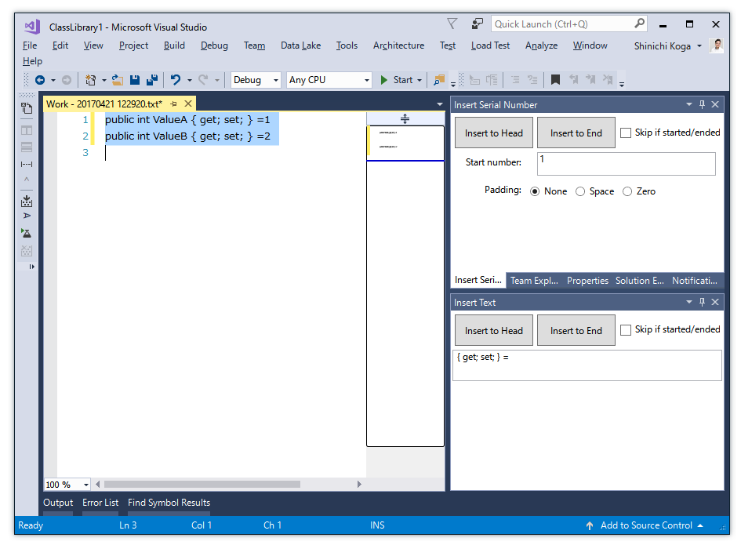
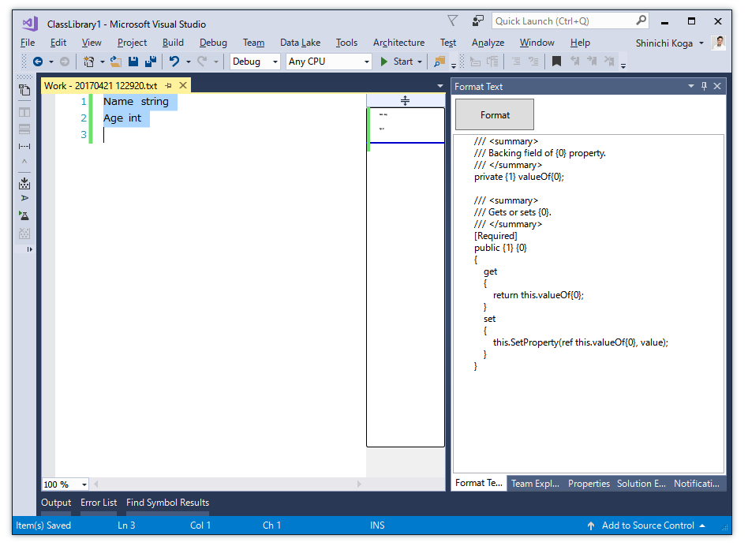

# EditorPlus

Some of text editor extensions, Format Text, Insert Serial Numbers and others for Microsoft Office and Visual Studio.

- [Download For Office 2016, 2013](https://github.com/surviveplus/EditorPlus/releases/tag/Office1.0.0.0)
- [Download For Visual Studio 2017](https://marketplace.visualstudio.com/items?itemName=SHIN-ICHIKOGA.EditorPlusforVisualStudio2017)
- [Download For Visual Studio 2015](https://marketplace.visualstudio.com/items?itemName=SHIN-ICHIKOGA.EditorPlus)

## Features (For Office Word, Excel, PowerPoint, Project)
### [ Edit Selection ] Ribbon Commands
- Increment from Upper cell (Excel)
- Increment Active cell (Excel)
- Increment Menu in Table  column (Excel)
- Insert Text (Word, Excel, PowerPoint, Project)
- Insert Serial Number (Project)
- Insert Now (Excel)
- Trim End (Excel)
### [ Clipboard ] Ribbon Commands
- Copy Text (PowerPoint)
- Copy No Line break Text  (Excel, PowerPoint)

## Features (For Visual Studio)
### [ FILE ] Menu Commands
- Create New Working Text File 
- Open Folder for the Active File 
### [ EDIT > Advanced ] Menu commands
- Insert Visual Basic Like Comments into End of Block ( for C# only ) 
- Enclose Selection in #region ( for C#, Visual Basic, JavaScript, TypeScript )
- Escape Selection to C# Text
- Escape Selection to Visual Basic Text 
- To Upper Camel
- To Lower Camel
### [ VIEW > Other Windows ] Tool Windows
- Format Text 
- Insert Text 
- Insert Serial Number 

## Installation & How to use
See [HowToUse-VS-en.md](HowToUse/HowToUse-VS-en.md)

## Screen Captures

