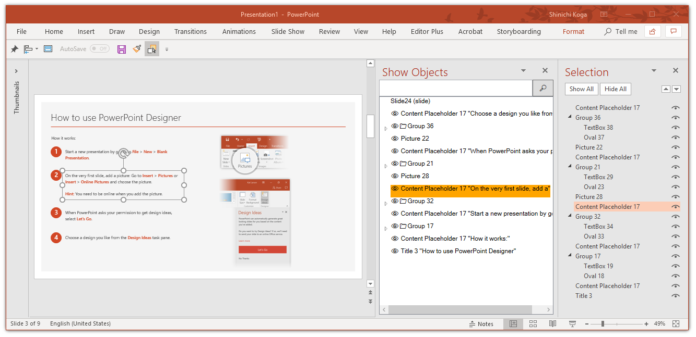
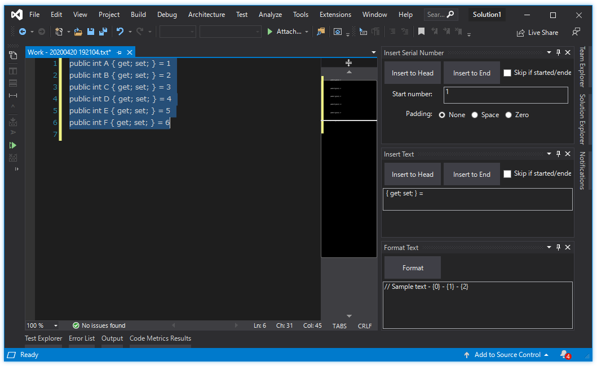

# EditorPlus

Some of text editor extensions, Format Text, Insert Serial Numbers and others for Microsoft Office and Visual Studio.

- [Download For Office (Windows Desktop 365, 2019, 2016, 2013)](https://github.com/surviveplus/EditorPlus/releases)
- [Download For Visual Studio 2017, 2019](https://marketplace.visualstudio.com/items?itemName=SHIN-ICHIKOGA.EditorPlusforVisualStudio2017)
- [Download For Visual Studio 2015](https://marketplace.visualstudio.com/items?itemName=SHIN-ICHIKOGA.EditorPlus)

## Features (For Office Outlook, Word, Excel, PowerPoint, Project)

### [ Items ] Ribbon Commands
- Bulk Add Tasks (Outlook)
### [ Edit Selection ] Ribbon Commands
-  Increment from Upper cell (Excel)
-  Increment Active cell (Excel)
-  Increment Max in Table  column (Excel)
-  Insert Text (Outlook, Word, Excel, PowerPoint, Project)
-  Insert Serial Number (Outlook, Word, Excel, PowerPoint, Project)
-  Insert Now (Excel)
-  Trim End (Excel)
### [ Objects ] Ribbon Commands
- Show Objects (PowerPoint)
- Navigation (PowerPoint)
### [ Name ] Ribbon Commands
- Replace Worksheet Names (Excel)
- Replace Object Names (PowerPoint)
### [ Clipboard ] Ribbon Commands
- Copy Text (PowerPoint)
- Copy No Line break Text  (Excel, PowerPoint)
### [ Window ] Ribbon Commands
-  Always on Top (Outlook, Word, Excel, PowerPoint, Project)

## Features (For Visual Studio)

### [ FILE ] Menu Commands
-  Create New Working Text File 
-  Open Folder for the Active File 
### [ EDIT > Advanced ] Menu commands
-  Insert Visual Basic Like Comments into End of Block ( for C# only ) 
-  Enclose Selection in #region ( for C#, Visual Basic, JavaScript, TypeScript )
-  Escape Selection to C# Text
-  Escape Selection to Visual Basic Text 
-  To Upper Camel
-  To Lower Camel
### [ VIEW > Other Windows ] Tool Windows
-  Format Text 
-  Insert Text 
-  Insert Serial Number 

## Installation & How to use

## Office add-in
- Download from [Releases](https://github.com/surviveplus/EditorPlus/releases) page.

## Visual Studio add-in
 - Download from Marketplace (Microsoft web page).
 - See [HowToUse-VS-en.md](HowToUse/HowToUse-VS-en.md)
